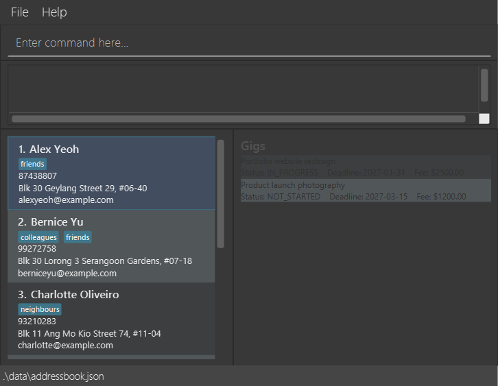

# Gigabyte

**Gigabyte** is a desktop app for **Freelancers** who manage multiple clients, projects, and payment deadlines independently. It is designed for users who prefer typing commands. 

## Why Gigabyte?

We help freelancers keep their client work and payment obligations organised, making it easier to prioritise tasks and avoid overdue invoices.

## Features

- Add a client and their contact details.
- View a client’s details and associated gigs.
- Search and filter client records.
- Edit client details.
- Create a gig linked to a client, including its status, deadline, and agreed fee.
- View gigs by client or status.
- Update a gig’s status.
- View upcoming gig deadlines in date order.
- Record an invoice or payment obligation linked to a gig.
- View outstanding and overdue payment obligations sorted by due date.
- Mark a payment obligation as paid.
- Preserve records when the application is closed and reopened.

## Documentation

For the detailed documentation of this project, see the **[Gigabyte Product Website](https://ay2627s1-cs2103t-w14-4.github.io/tp/)**.

## Acknowledgements

This project is based on the **AddressBook-Level3** project created by the [SE-EDU initiative](https://se-education.org).
