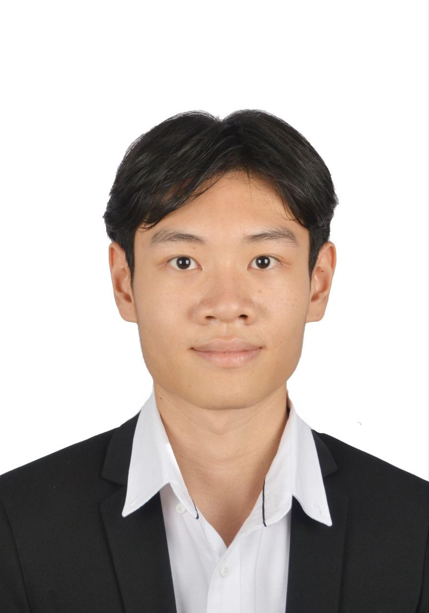
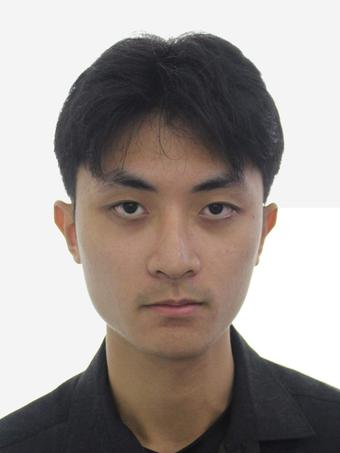
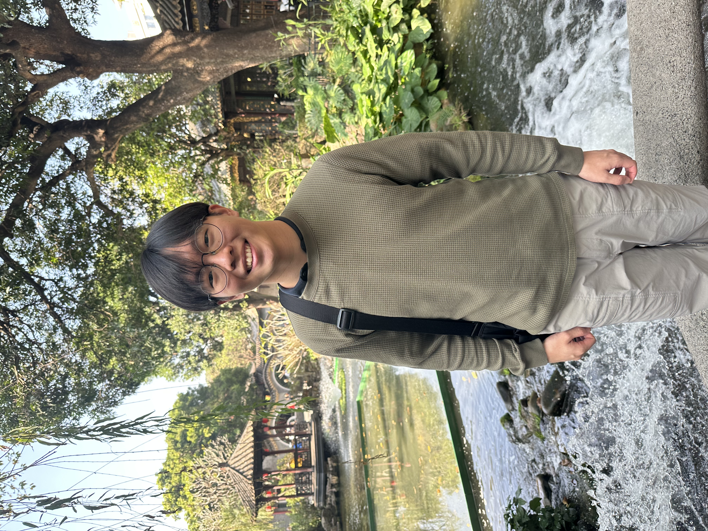

# About Us

We are a team based in the [School of Computing, National University of Singapore](http://www.comp.nus.edu.sg).

You can reach us at the email `gigabyte[at]comp.nus.edu.sg`

## Project team

### Tang Ming Hong

[[github](https://github.com/minghong-dev)]

* Role: -
* Responsibilities: -

### Lim Kerjun

[[github](https://github.com/patientotter)]

* Role: Developer
* Responsibilities: Data

### Axel Heng

[[github](http://github.com/axelheng)]

* Role: Developer
* Responsibilities: coding! (placeholder)

### Clement

[[github](http://github.com/ApproxNeo)]
[[portfolio](team/ApproxNeo.md)]

* Role: Developer
* Responsibilities: coding! (placeholder)
